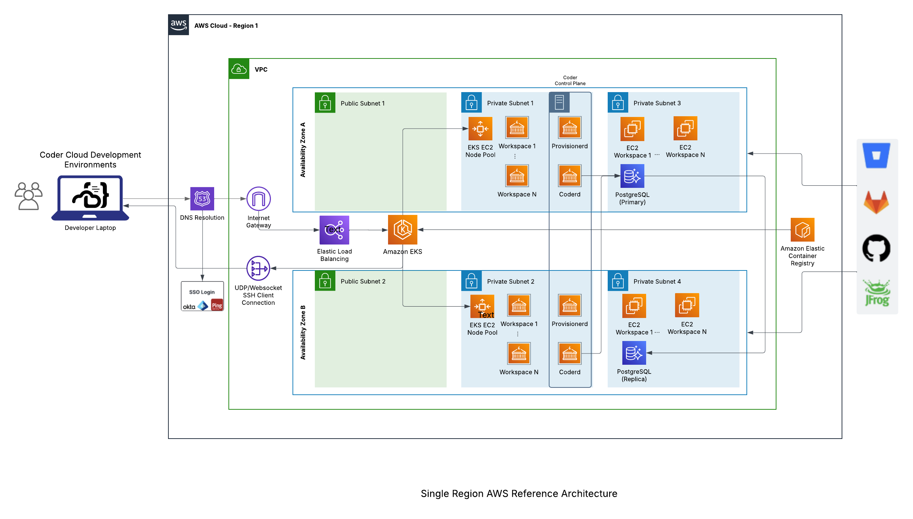

# Create Foundational EKS Cluster Resources 

## Deploy AWS Services needed for Coder Control Plane  <!-- MODIFY THIS SUBHEADING -->


We will be deploying the core Coder Control Plane as containers using AWS EKS as depicted in the reference architecture above.  To provide the necessary foundational AWS services (VPC, Compute, Storage), we will be using the eksctl cli to which will auto-generate the necessary services in conjunction with creating the needed EKS cluster.

From the AWS Cloudshell and in the AWS account/region being used for the workshop, perform the following steps:

#### Step 1: Create an EKS Cluster
```bash
# Create EKS Cluster (customize the cluster name and region as needed)
eksctl create cluster --name=your-cluster-name --enable-auto-mode --region your-region
```
#### Step 2: Validate EKS Cluster Deployment
After waiting 10-15 min for the EKS Cluster and supporting AWS Services to complete (Deployment can be monitored in CloudFormation), execute the following commands to retrieve your EKS cluster context and validate the EKS cluster deployment.
```bash
# Update the cluster name and region as needed
aws eks update-kubeconfig --name your-cluster-name --region your-region

# List the EKS Nodes and validate their stats as "Ready"
kubectl get nodes
```

#### Step 3: Configure Storage for the Cluster
```bash
# Deploy a K8S StorageClass for dynamic EBS volume provisioning
kubectl apply -f - <<EOF
apiVersion: storage.k8s.io/v1
kind: StorageClass
metadata:
  name: gp3-csi
  annotations:
    storageclass.kubernetes.io/is-default-class: "true"
provisioner: ebs.csi.eks.amazonaws.com
volumeBindingMode: WaitForFirstConsumer
parameters:
  type: gp3
  encrypted: "true"
allowVolumeExpansion: true
EOF
```

### Next Section Heading <!-- MODIFY THIS HEADING -->
This paragraph block can optionally be utilized to lead into the next section of the workshop.
